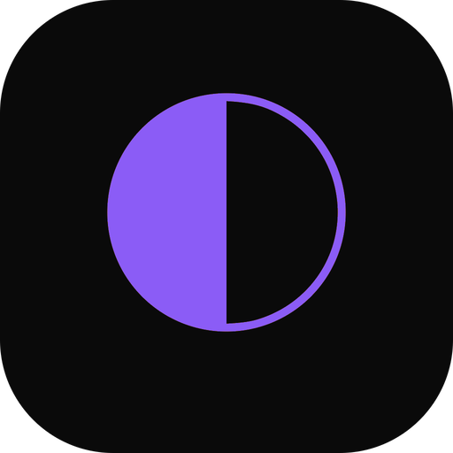

# opcode

> **⚠️ Project Notice**: This project is a Chinese localization fork based on [winfunc/opcode](https://github.com/winfunc/opcode). Thanks to the original author for their contributions.

<div align="center">
  

  <h1>opcode</h1>

  <p>
    <strong>A powerful GUI app and Toolkit for Claude Code</strong>
  </p>
  <p>
    <strong>Create custom agents, manage interactive Claude Code sessions, run secure background agents, and more.</strong>
  </p>

  <p>
    <a href="#features"></a>
    <a href="#installation"></a>
    <a href="#usage"></a>
    <a href="#development"></a>
    <a href="https://discord.com/invite/KYwhHVzUsY"></a>
    <a href="README.md"></a>
  </p>
</div>


https://github.com/user-attachments/assets/6bceea0f-60b6-4c3e-a745-b891de00b8d0

> [!TIP]
> **⭐ Star the repo and follow [@getAsterisk](https://x.com/getAsterisk) on X for early access to `asteria-swe-v0`**.

> [!NOTE]
> **This project is not affiliated with, endorsed by, or sponsored by Anthropic. Claude is a trademark of Anthropic, PBC. This is an independent developer project using Claude.**

## <span id="overview-title">🌟 Overview</span>

**<span id="overview-description">opcode</span>** <span id="overview-description-2">is a powerful desktop application that transforms how you interact with Claude Code. Built with Tauri 2, it provides a beautiful GUI for managing your Claude Code sessions, creating custom agents, tracking usage, and much more.</span>

<span id="overview-command-center">Think of opcode as your command center for Claude Code - bridging the gap between the command-line tool and a visual experience that makes AI-assisted development more intuitive and productive.</span>

## <span id="toc-title">📋 Table of Contents</span>

- [<span id="toc-overview">🌟 Overview</span>](#-overview)
- [<span id="toc-features">✨ Features</span>](#-features)
  - [<span id="toc-project">🗂️ Project & Session Management</span>](#️-project--session-management)
  - [<span id="toc-agents">🤖 CC Agents</span>](#-cc-agents)
  - [<span id="toc-analytics">📊 Usage Analytics Dashboard</span>](#-usage-analytics-dashboard)
  - [<span id="toc-mcp">🔌 MCP Server Management</span>](#-mcp-server-management)
  - [<span id="toc-timeline">⏰ Timeline & Checkpoints</span>](#-timeline--checkpoints)
  - [<span id="toc-claude">📝 CLAUDE.md Management</span>](#-claudemd-management)
- [<span id="toc-usage">📖 Usage</span>](#-usage)
  - [<span id="toc-getting-started">Getting Started</span>](#getting-started)
  - [<span id="toc-managing-projects">Managing Projects</span>](#managing-projects)
  - [<span id="toc-creating-agents">Creating Agents</span>](#creating-agents)
  - [<span id="toc-tracking">Tracking Usage</span>](#tracking-usage)
  - [<span id="toc-working-mcp">Working with MCP Servers</span>](#working-with-mcp-servers)
- [<span id="toc-installation">🚀 Installation</span>](#-installation)
- [<span id="toc-build">🔨 Build from Source</span>](#-build-from-source)
- [<span id="toc-development">🛠️ Development</span>](#️-development)
- [<span id="toc-security">🔒 Security</span>](#-security)
- [<span id="toc-contributing">🤝 Contributing</span>](#-contributing)
- [<span id="toc-license">📄 License</span>](#-license)
- [<span id="toc-acknowledgments">🙏 Acknowledgments</span>](#-acknowledgments)

## <span id="features-title">✨ Features</span>

### <span id="features-project-title">🗂️ Project & Session Management</span>
- **<span id="features-browser">Visual Project Browser</span>**: <span id="features-browser-desc">Navigate through all your Claude Code projects in `~/.claude/projects/`</span>
- **<span id="features-history">Session History</span>**: <span id="features-history-desc">View and resume past coding sessions with full context</span>
- **<span id="features-search">Smart Search</span>**: <span id="features-search-desc">Find projects and sessions quickly with built-in search</span>
- **<span id="features-insights">Session Insights</span>**: <span id="features-insights-desc">See first messages, timestamps, and session metadata at a glance</span>

### <span id="features-agents-title">🤖 CC Agents</span>
- **<span id="features-custom">Custom AI Agents</span>**: <span id="features-custom-desc">Create specialized agents with custom system prompts and behaviors</span>
- **<span id="features-library">Agent Library</span>**: <span id="features-library-desc">Build a collection of purpose-built agents for different tasks</span>
- **<span id="features-background">Background Execution</span>**: <span id="features-background-desc">Run agents in separate processes for non-blocking operations</span>
- **<span id="features-execution">Execution History</span>**: <span id="features-execution-desc">Track all agent runs with detailed logs and performance metrics</span>

### <span id="features-analytics-title">📊 Usage Analytics Dashboard</span>
- **<span id="features-cost">Cost Tracking</span>**: <span id="features-cost-desc">Monitor your Claude API usage and costs in real-time</span>
- **<span id="features-token">Token Analytics</span>**: <span id="features-token-desc">Detailed breakdown by model, project, and time period</span>
- **<span id="features-charts">Visual Charts</span>**: <span id="features-charts-desc">Beautiful charts showing usage trends and patterns</span>
- **<span id="features-export">Export Data</span>**: <span id="features-export-desc">Export usage data for accounting and analysis</span>

### <span id="features-mcp-title">🔌 MCP Server Management</span>
- **<span id="features-registry">Server Registry</span>**: <span id="features-registry-desc">Manage Model Context Protocol servers from a central UI</span>
- **<span id="features-configuration">Easy Configuration</span>**: <span id="features-configuration-desc">Add servers via UI or import from existing configs</span>
- **<span id="features-testing">Connection Testing</span>**: <span id="features-testing-desc">Verify server connectivity before use</span>
- **<span id="features-import">Claude Desktop Import</span>**: <span id="features-import-desc">Import server configurations from Claude Desktop</span>

### <span id="features-timeline-title">⏰ Timeline & Checkpoints</span>
- **<span id="features-versioning">Session Versioning</span>**: <span id="features-versioning-desc">Create checkpoints at any point in your coding session</span>
- **<span id="features-visual">Visual Timeline</span>**: <span id="features-visual-desc">Navigate through your session history with a branching timeline</span>
- **<span id="features-restore">Instant Restore</span>**: <span id="features-restore-desc">Jump back to any checkpoint with one click</span>
- **<span id="features-fork">Fork Sessions</span>**: <span id="features-fork-desc">Create new branches from existing checkpoints</span>
- **<span id="features-diff">Diff Viewer</span>**: <span id="features-diff-desc">See exactly what changed between checkpoints</span>

### <span id="features-claude-title">📝 CLAUDE.md Management</span>
- **<span id="features-editor">Built-in Editor</span>**: <span id="features-editor-desc">Edit CLAUDE.md files directly within the app</span>
- **<span id="features-preview">Live Preview</span>**: <span id="features-preview-desc">See your markdown rendered in real-time</span>
- **<span id="features-scanner">Project Scanner</span>**: <span id="features-scanner-desc">Find all CLAUDE.md files in your projects</span>
- **<span id="features-syntax">Syntax Highlighting</span>**: <span id="features-syntax-desc">Full markdown support with syntax highlighting</span>

## <span id="usage-title">📖 Usage</span>

### <span id="getting-started-title">Getting Started</span>

1. **<span id="getting-started-launch">Launch opcode</span>**: <span id="getting-started-launch-desc">Open the application after installation</span>
2. **<span id="getting-started-welcome">Welcome Screen</span>**: <span id="getting-started-welcome-desc">Choose between CC Agents or Projects</span>
3. **<span id="getting-started-setup">First Time Setup</span>**: <span id="getting-started-setup-desc">opcode will automatically detect your `~/.claude` directory</span>

### <span id="managing-projects-title">Managing Projects</span>

```
<span id="managing-projects-workflow">Projects → Select Project → View Sessions → Resume or Start New</span>
```

- <span id="managing-projects-click">Click on any project to view its sessions</span>
- <span id="managing-projects-each">Each session shows the first message and timestamp</span>
- <span id="managing-projects-resume">Resume sessions directly or start new ones</span>

### <span id="creating-agents-title">Creating Agents</span>

```
<span id="creating-agents-workflow">CC Agents → Create Agent → Configure → Execute</span>
```

1. **<span id="creating-agents-design">Design Your Agent</span>**: <span id="creating-agents-design-desc">Set name, icon, and system prompt</span>
2. **<span id="creating-agents-model">Configure Model</span>**: <span id="creating-agents-model-desc">Choose between available Claude models</span>
3. **<span id="creating-agents-permissions">Set Permissions</span>**: <span id="creating-agents-permissions-desc">Configure file read/write and network access</span>
4. **<span id="creating-agents-tasks">Execute Tasks</span>**: <span id="creating-agents-tasks-desc">Run your agent on any project</span>

### <span id="tracking-usage-title">Tracking Usage</span>

```
<span id="tracking-usage-workflow">Menu → Usage Dashboard → View Analytics</span>
```

- <span id="tracking-usage-monitor">Monitor costs by model, project, and date</span>
- <span id="tracking-usage-export">Export data for reports</span>
- <span id="tracking-usage-alerts">Set up usage alerts (coming soon)</span>

### <span id="working-mcp-title">Working with MCP Servers</span>

```
<span id="working-mcp-workflow">Menu → MCP Manager → Add Server → Configure</span>
```

- <span id="working-mcp-add">Add servers manually or via JSON</span>
- <span id="working-mcp-import">Import from Claude Desktop configuration</span>
- <span id="working-mcp-test">Test connections before using</span>

## <span id="installation-title">🚀 Installation</span>

### <span id="prerequisites-title">Prerequisites</span>

- **<span id="prerequisites-claude">Claude Code CLI</span>**: <span id="prerequisites-claude-desc">Install from [Claude's official site](https://claude.ai/code)</span>

### <span id="release-title">Release Executables Will Be Published Soon</span>

## <span id="build-title">🔨 Build from Source</span>

### <span id="build-prerequisites-title">Prerequisites</span>

<span id="build-prerequisites-desc">Before building opcode from source, ensure you have the following installed:</span>

#### <span id="system-title">System Requirements</span>

- **<span id="system-os">Operating System</span>**: <span id="system-os-desc">Windows 10/11, macOS 11+, or Linux (Ubuntu 20.04+)</span>
- **<span id="system-ram">RAM</span>**: <span id="system-ram-desc">Minimum 4GB (8GB recommended)</span>
- **<span id="system-storage">Storage</span>**: <span id="system-storage-desc">At least 1GB free space</span>

#### <span id="tools-title">Required Tools</span>

1. **<span id="tools-rust">Rust</span>** <span id="tools-rust-version">(1.70.0 or later)</span>
   ```bash
   # <span id="tools-rust-install">Install via rustup</span>
   curl --proto '=https' --tlsv1.2 -sSf https://sh.rustup.rs | sh
   ```

2. **<span id="tools-bun">Bun</span>** <span id="tools-bun-version">(latest version)</span>
   ```bash
   # <span id="tools-bun-install">Install bun</span>
   curl -fsSL https://bun.sh/install | bash
   ```

3. **<span id="tools-git">Git</span>**
   ```bash
   # <span id="tools-git-install">Usually pre-installed, but if not:</span>
   # <span id="tools-git-ubuntu">Ubuntu/Debian: sudo apt install git</span>
   # <span id="tools-git-macos">macOS: brew install git</span>
   # <span id="tools-git-windows">Windows: Download from https://git-scm.com</span>
   ```

4. **<span id="tools-claude">Claude Code CLI</span>**
   - <span id="tools-claude-download">Download and install from [Claude's official site](https://claude.ai/code)</span>
   - <span id="tools-claude-path">Ensure `claude` is available in your PATH</span>

#### <span id="platform-title">Platform-Specific Dependencies</span>

**<span id="platform-linux">Linux (Ubuntu/Debian)</span>**
```bash
# <span id="platform-linux-install">Install system dependencies</span>
sudo apt update
sudo apt install -y \
  libwebkit2gtk-4.1-dev \
  libgtk-3-dev \
  libayatana-appindicator3-dev \
  librsvg2-dev \
  patchelf \
  build-essential \
  curl \
  wget \
  file \
  libssl-dev \
  libxdo-dev \
  libsoup-3.0-dev \
  libjavascriptcoregtk-4.1-dev
```

**<span id="platform-macos">macOS</span>**
```bash
# <span id="platform-macos-install">Install Xcode Command Line Tools</span>
xcode-select --install

# <span id="platform-macos-brew">Install additional dependencies via Homebrew (optional)</span>
brew install pkg-config
```

**<span id="platform-windows">Windows</span>**
- <span id="platform-windows-cpp">Install [Microsoft C++ Build Tools](https://visualstudio.microsoft.com/visual-cpp-build-tools/)</span>
- <span id="platform-windows-webview">Install [WebView2](https://developer.microsoft.com/microsoft-edge/webview2/) (usually pre-installed on Windows 11)</span>

### <span id="build-steps-title">Build Steps</span>

1. **<span id="build-clone">Clone the Repository</span>**
   ```bash
   git clone https://github.com/getAsterisk/opcode.git
   cd opcode
   ```

2. **<span id="build-install">Install Frontend Dependencies</span>**
   ```bash
   bun install
   ```

3. **<span id="build-app">Build the Application</span>**
   
   **<span id="build-dev">For Development (with hot reload)</span>**
   ```bash
   bun run tauri dev
   ```
   
   **<span id="build-prod">For Production Build</span>**
   ```bash
   # <span id="build-prod-desc">Build the application</span>
   bun run tauri build
   
   # <span id="build-prod-location">The built executable will be in:</span>
   # <span id="build-prod-linux">- Linux: src-tauri/target/release/</span>
   # <span id="build-prod-macos">- macOS: src-tauri/target/release/</span>
   # <span id="build-prod-windows">- Windows: src-tauri/target/release/</span>
   ```

4. **<span id="build-options">Platform-Specific Build Options</span>**
   
   **<span id="build-debug">Debug Build (faster compilation, larger binary)</span>**
   ```bash
   bun run tauri build --debug
   ```
   
   **<span id="build-universal">Universal Binary for macOS (Intel + Apple Silicon)</span>**
   ```bash
   bun run tauri build --target universal-apple-darwin
   ```

### <span id="troubleshooting-title">Troubleshooting</span>

#### <span id="common-title">Common Issues</span>

1. **<span id="issue-cargo">"cargo not found" error</span>**
   - <span id="issue-cargo-fix1">Ensure Rust is installed and `~/.cargo/bin` is in your PATH</span>
   - <span id="issue-cargo-fix2">Run `source ~/.cargo/env` or restart your terminal</span>

2. **<span id="issue-webkit">Linux: "webkit2gtk not found" error</span>**
   - <span id="issue-webkit-fix1">Install the webkit2gtk development packages listed above</span>
   - <span id="issue-webkit-fix2">On newer Ubuntu versions, you might need `libwebkit2gtk-4.0-dev`</span>

3. **<span id="issue-msvc">Windows: "MSVC not found" error</span>**
   - <span id="issue-msvc-fix">Install Visual Studio Build Tools with C++ support</span>
   - <span id="issue-msvc-restart">Restart your terminal after installation</span>

4. **<span id="issue-claude">"claude command not found" error</span>**
   - <span id="issue-claude-fix1">Ensure Claude Code CLI is installed and in your PATH</span>
   - <span id="issue-claude-fix2">Test with `claude --version`</span>

5. **<span id="issue-memory">Build fails with "out of memory"</span>**
   - <span id="issue-memory-fix1">Try building with fewer parallel jobs: `cargo build -j 2`</span>
   - <span id="issue-memory-fix2">Close other applications to free up RAM</span>

#### <span id="verify-title">Verify Your Build</span>

<span id="verify-desc">After building, you can verify the application works:</span>

```bash
# <span id="verify-run">Run the built executable directly</span>
# <span id="verify-linux">Linux/macOS</span>
./src-tauri/target/release/opcode

# <span id="verify-windows">Windows</span>
./src-tauri/target/release/opcode.exe
```

### <span id="artifacts-title">Build Artifacts</span>

<span id="artifacts-desc">The build process creates several artifacts:</span>

- **<span id="artifacts-executable">Executable</span>**: <span id="artifacts-executable-desc">The main opcode application</span>
- **<span id="artifacts-installers">Installers</span>** <span id="artifacts-installers-desc">(when using `tauri build`):</span>
  - <span id="artifacts-deb">`.deb` package (Linux)</span>
  - <span id="artifacts-appimage">`.AppImage` (Linux)</span>
  - <span id="artifacts-dmg">`.dmg` installer (macOS)</span>
  - <span id="artifacts-msi">`.msi` installer (Windows)</span>
  - <span id="artifacts-exe">`.exe` installer (Windows)</span>

<span id="artifacts-location">All artifacts are located in `src-tauri/target/release/`.</span>

## <span id="development-title">🛠️ Development</span>

### <span id="tech-title">Tech Stack</span>

- **<span id="tech-frontend">Frontend</span>**: <span id="tech-frontend-desc">React 18 + TypeScript + Vite 6</span>
- **<span id="tech-backend">Backend</span>**: <span id="tech-backend-desc">Rust with Tauri 2</span>
- **<span id="tech-ui">UI Framework</span>**: <span id="tech-ui-desc">Tailwind CSS v4 + shadcn/ui</span>
- **<span id="tech-database">Database</span>**: <span id="tech-database-desc">SQLite (via rusqlite)</span>
- **<span id="tech-package">Package Manager</span>**: <span id="tech-package-desc">Bun</span>

### <span id="structure-title">Project Structure</span>

```
<span id="structure-desc">opcode/
├── src/                   # React frontend
│   ├── components/        # UI components
│   ├── lib/               # API client & utilities
│   └── assets/            # Static assets
├── src-tauri/             # Rust backend
│   ├── src/
│   │   ├── commands/      # Tauri command handlers
│   │   ├── checkpoint/    # Timeline management
│   │   └── process/       # Process management
│   └── tests/             # Rust test suite
└── public/                # Public assets</span>
```

### <span id="commands-title">Development Commands</span>

```bash
# <span id="commands-dev">Start development server</span>
bun run tauri dev

# <span id="commands-frontend">Run frontend only</span>
bun run dev

# <span id="commands-types">Type checking</span>
bunx tsc --noEmit

# <span id="commands-rust">Run Rust tests</span>
cd src-tauri && cargo test

# <span id="commands-format">Format code</span>
cd src-tauri && cargo fmt
```

## <span id="security-title">🔒 Security</span>

<span id="security-desc">opcode prioritizes your privacy and security:</span>

1. **<span id="security-process">Process Isolation</span>**: <span id="security-process-desc">Agents run in separate processes</span>
2. **<span id="security-permissions">Permission Control</span>**: <span id="security-permissions-desc">Configure file and network access per agent</span>
3. **<span id="security-storage">Local Storage</span>**: <span id="security-storage-desc">All data stays on your machine</span>
4. **<span id="security-telemetry">No Telemetry</span>**: <span id="security-telemetry-desc">No data collection or tracking</span>
5. **<span id="security-source">Open Source</span>**: <span id="security-source-desc">Full transparency through open source code</span>

## <span id="contributing-title">🤝 Contributing</span>

<span id="contributing-desc">We welcome contributions! Please see our [Contributing Guide](CONTRIBUTING.md) for details.</span>

### <span id="contribute-areas-title">Areas for Contribution</span>

- <span id="contribute-bugs">🐛 Bug fixes and improvements</span>
- <span id="contribute-features">✨ New features and enhancements</span>
- <span id="contribute-docs">📚 Documentation improvements</span>
- <span id="contribute-ui">🎨 UI/UX enhancements</span>
- <span id="contribute-tests">🧪 Test coverage</span>
- <span id="contribute-i18n">🌐 Internationalization</span>

## <span id="license-title">📄 License</span>

<span id="license-desc">This project is licensed under the AGPL License - see the [LICENSE](LICENSE) file for details.</span>

## <span id="acknowledgments-title">🙏 Acknowledgments</span>

- <span id="acknowledgments-tauri">Built with [Tauri](https://tauri.app/) - The secure framework for building desktop apps</span>
- <span id="acknowledgments-claude">[Claude](https://claude.ai) by Anthropic</span>

---

<div align="center">
  <p>
    <strong id="made-with"><span id="made-with-text">Made with ❤️ by the</span> <a href="https://asterisk.so/">Asterisk</a></strong>
  </p>
  <p>
    <a href="https://github.com/getAsterisk/opcode/issues"><span id="report-bug">Report Bug</span></a>
    ·
    <a href="https://github.com/getAsterisk/opcode/issues"><span id="request-feature">Request Feature</span></a>
  </p>
</div>

## <span id="star-title">Star History</span>

[](https://www.star-history.com/#getAsterisk/opcode&Date)

<script>
// 简化的语言切换功能
function switchLanguage(lang) {
  // 中文翻译
  const zh = {
    subtitle: "一个强大的 GUI 应用程序和 Claude Code 工具包",
    description: "创建自定义代理，管理交互式 Claude Code 会话，运行安全的后台代理，以及更多功能。",
    "language-label": "语言:",
    "tip-star": "⭐ 给仓库点星并在 X 上关注 [@getAsterisk](https://x.com/getAsterisk) 以获取 `asteria-swe-v0` 的早期访问权限",
    "note-affiliation": "本项目与 Anthropic 无关，未获得其认可或赞助。Claude 是 Anthropic, PBC 的商标。这是一个使用 Claude 的独立开发者项目。",
    "overview-title": "🌟 概述",
    "overview-description": "opcode",
    "overview-description-2": "是一个强大的桌面应用程序，改变了您与 Claude Code 的交互方式。基于 Tauri 2 构建，它提供了美观的 GUI 来管理您的 Claude Code 会话、创建自定义代理、跟踪使用情况等等。",
    "overview-command-center": "将 opcode 视为您的 Claude Code 指挥中心 - 弥合命令行工具与视觉体验之间的差距，使 AI 辅助开发更加直观和高效。",
    "toc-title": "📋 目录",
    "toc-overview": "🌟 概述",
    "toc-features": "✨ 功能",
    "toc-project": "🗂️ 项目和会话管理",
    "toc-agents": "🤖 CC 代理",
    "toc-analytics": "📊 使用分析仪表板",
    "toc-mcp": "🔌 MCP 服务器管理",
    "toc-timeline": "⏰ 时间线和检查点",
    "toc-claude": "📝 CLAUDE.md 管理",
    "toc-usage": "📖 使用",
    "toc-getting-started": "入门指南",
    "toc-managing-projects": "管理项目",
    "toc-creating-agents": "创建代理",
    "toc-tracking": "跟踪使用情况",
    "toc-working-mcp": "使用 MCP 服务器",
    "toc-installation": "🚀 安装",
    "toc-build": "🔨 从源码构建",
    "toc-development": "🛠️ 开发",
    "toc-security": "🔒 安全性",
    "toc-contributing": "🤝 贡献",
    "toc-license": "📄 许可证",
    "toc-acknowledgments": "🙏 致谢",
    "features-title": "✨ 功能",
    "features-project-title": "🗂️ 项目和会话管理",
    "features-browser": "可视化项目浏览器",
    "features-browser-desc": "浏览 `~/.claude/projects/` 中的所有 Claude Code 项目",
    "features-history": "会话历史",
    "features-history-desc": "查看和恢复带有完整上下文的过去编码会话",
    "features-search": "智能搜索",
    "features-search-desc": "使用内置搜索快速查找项目和会话",
    "features-insights": "会话洞察",
    "features-insights-desc": "一目了然地查看第一条消息、时间戳和会话元数据",
    "features-agents-title": "🤖 CC 代理",
    "features-custom": "自定义 AI 代理",
    "features-custom-desc": "创建具有自定义系统提示和行为的专用代理",
    "features-library": "代理库",
    "features-library-desc": "为不同任务构建专用代理集合",
    "features-background": "后台执行",
    "features-background-desc": "在单独的进程中运行代理以实现非阻塞操作",
    "features-execution": "执行历史",
    "features-execution-desc": "跟踪所有代理运行，包含详细日志和性能指标",
    "features-analytics-title": "📊 使用分析仪表板",
    "features-cost": "成本跟踪",
    "features-cost-desc": "实时监控 Claude API 使用情况和成本",
    "features-token": "令牌分析",
    "features-token-desc": "按模型、项目和时间段的详细分析",
    "features-charts": "可视化图表",
    "features-charts-desc": "显示使用趋势和模式的精美图表",
    "features-export": "导出数据",
    "features-export-desc": "导出使用数据用于会计和分析",
    "features-mcp-title": "🔌 MCP 服务器管理",
    "features-registry": "服务器注册表",
    "features-registry-desc": "从中央 UI 管理模型上下文协议服务器",
    "features-configuration": "轻松配置",
    "features-configuration-desc": "通过 UI 添加服务器或从现有配置导入",
    "features-testing": "连接测试",
    "features-testing-desc": "在使用前验证服务器连接",
    "features-import": "Claude Desktop 导入",
    "features-import-desc": "从 Claude Desktop 导入服务器配置",
    "features-timeline-title": "⏰ 时间线和检查点",
    "features-versioning": "会话版本控制",
    "features-versioning-desc": "在编码会话的任何时刻创建检查点",
    "features-visual": "可视化时间线",
    "features-visual-desc": "通过分支时间线浏览会话历史",
    "features-restore": "即时恢复",
    "features-restore-desc": "一键跳回任何检查点",
    "features-fork": "分支会话",
    "features-fork-desc": "从现有检查点创建新分支",
    "features-diff": "差异查看器",
    "features-diff-desc": "查看检查点之间的确切变化",
    "features-claude-title": "📝 CLAUDE.md 管理",
    "features-editor": "内置编辑器",
    "features-editor-desc": "直接在应用程序中编辑 CLAUDE.md 文件",
    "features-preview": "实时预览",
    "features-preview-desc": "实时查看 markdown 渲染效果",
    "features-scanner": "项目扫描器",
    "features-scanner-desc": "在项目中查找所有 CLAUDE.md 文件",
    "features-syntax": "语法高亮",
    "features-syntax-desc": "完整的 markdown 支持和语法高亮",
    "usage-title": "📖 使用",
    "getting-started-title": "入门指南",
    "getting-started-launch": "启动 opcode",
    "getting-started-launch-desc": "安装后打开应用程序",
    "getting-started-welcome": "欢迎屏幕",
    "getting-started-welcome-desc": "选择 CC 代理或项目",
    "getting-started-setup": "首次设置",
    "getting-started-setup-desc": "opcode 将自动检测您的 `~/.claude` 目录",
    "managing-projects-title": "管理项目",
    "managing-projects-workflow": "项目 → 选择项目 → 查看会话 → 恢复或开始新的",
    "managing-projects-click": "点击任何项目以查看其会话",
    "managing-projects-each": "每个会话显示第一条消息和时间戳",
    "managing-projects-resume": "直接恢复会话或开始新的会话",
    "creating-agents-title": "创建代理",
    "creating-agents-workflow": "CC 代理 → 创建代理 → 配置 → 执行",
    "creating-agents-design": "设计您的代理",
    "creating-agents-design-desc": "设置名称、图标和系统提示",
    "creating-agents-model": "配置模型",
    "creating-agents-model-desc": "选择可用的 Claude 模型",
    "creating-agents-permissions": "设置权限",
    "creating-agents-permissions-desc": "配置文件读/写和网络访问权限",
    "creating-agents-tasks": "执行任务",
    "creating-agents-tasks-desc": "在任何项目上运行您的代理",
    "tracking-usage-title": "跟踪使用情况",
    "tracking-usage-workflow": "菜单 → 使用仪表板 → 查看分析",
    "tracking-usage-monitor": "按模型、项目和日期监控成本",
    "tracking-usage-export": "导出数据用于报告",
    "tracking-usage-alerts": "设置使用警报（即将推出）",
    "working-mcp-title": "使用 MCP 服务器",
    "working-mcp-workflow": "菜单 → MCP 管理器 → 添加服务器 → 配置",
    "working-mcp-add": "手动或通过 JSON 添加服务器",
    "working-mcp-import": "从 Claude Desktop 配置导入",
    "working-mcp-test": "使用前测试连接",
    "installation-title": "🚀 安装",
    "prerequisites-title": "先决条件",
    "prerequisites-claude": "Claude Code CLI",
    "prerequisites-claude-desc": "从 [Claude 官方网站](https://claude.ai/code) 安装",
    "release-title": "可执行版本即将发布",
    "build-title": "🔨 从源码构建",
    "build-prerequisites-title": "先决条件",
    "build-prerequisites-desc": "在从源码构建 opcode 之前，请确保已安装以下内容：",
    "system-title": "系统要求",
    "system-os": "操作系统",
    "system-os-desc": "Windows 10/11、macOS 11+ 或 Linux (Ubuntu 20.04+)",
    "system-ram": "内存",
    "system-ram-desc": "最低 4GB（推荐 8GB）",
    "system-storage": "存储",
    "system-storage-desc": "至少 1GB 可用空间",
    "tools-title": "必需工具",
    "tools-rust": "Rust",
    "tools-rust-version": "(1.70.0 或更高版本)",
    "tools-rust-install": "通过 rustup 安装",
    "tools-bun": "Bun",
    "tools-bun-version": "(最新版本)",
    "tools-bun-install": "安装 bun",
    "tools-git": "Git",
    "tools-git-install": "通常已预装，如果没有：",
    "tools-git-ubuntu": "Ubuntu/Debian: sudo apt install git",
    "tools-git-macos": "macOS: brew install git",
    "tools-git-windows": "Windows: 从 https://git-scm.com 下载",
    "tools-claude": "Claude Code CLI",
    "tools-claude-download": "从 [Claude 官方网站](https://claude.ai/code) 下载并安装",
    "tools-claude-path": "确保 `claude` 在您的 PATH 中可用",
    "platform-title": "平台特定依赖",
    "platform-linux": "Linux (Ubuntu/Debian)",
    "platform-linux-install": "安装系统依赖",
    "platform-macos": "macOS",
    "platform-macos-install": "安装 Xcode 命令行工具",
    "platform-macos-brew": "通过 Homebrew 安装额外依赖（可选）",
    "platform-windows": "Windows",
    "platform-windows-cpp": "安装 [Microsoft C++ 构建工具](https://visualstudio.microsoft.com/visual-cpp-build-tools/)",
    "platform-windows-webview": "安装 [WebView2](https://developer.microsoft.com/microsoft-edge/webview2/) (Windows 11 通常已预装)",
    "build-steps-title": "构建步骤",
    "build-clone": "克隆仓库",
    "build-install": "安装前端依赖",
    "build-app": "构建应用程序",
    "build-dev": "用于开发（热重载）",
    "build-prod": "用于生产构建",
    "build-prod-desc": "构建应用程序",
    "build-prod-location": "构建的可执行文件将位于：",
    "build-prod-linux": "- Linux: src-tauri/target/release/",
    "build-prod-macos": "- macOS: src-tauri/target/release/",
    "build-prod-windows": "- Windows: src-tauri/target/release/",
    "build-options": "平台特定构建选项",
    "build-debug": "调试构建（编译更快，二进制文件更大）",
    "build-universal": "macOS 通用二进制文件（Intel + Apple Silicon）",
    "troubleshooting-title": "故障排除",
    "common-title": "常见问题",
    "issue-cargo": "\"cargo not found\" 错误",
    "issue-cargo-fix1": "确保 Rust 已安装并且 `~/.cargo/bin` 在您的 PATH 中",
    "issue-cargo-fix2": "运行 `source ~/.cargo/env` 或重新启动终端",
    "issue-webkit": "Linux: \"webkit2gtk not found\" 错误",
    "issue-webkit-fix1": "安装上面列出的 webkit2gtk 开发包",
    "issue-webkit-fix2": "在较新的 Ubuntu 版本上，您可能需要 `libwebkit2gtk-4.0-dev`",
    "issue-msvc": "Windows: \"MSVC not found\" 错误",
    "issue-msvc-fix": "安装带 C++ 支持的 Visual Studio 构建工具",
    "issue-msvc-restart": "安装后重新启动终端",
    "issue-claude": "\"claude command not found\" 错误",
    "issue-claude-fix1": "确保 Claude Code CLI 已安装并在您的 PATH 中",
    "issue-claude-fix2": "使用 `claude --version` 测试",
    "issue-memory": "构建失败并显示 \"out of memory\"",
    "issue-memory-fix1": "尝试使用较少的并行作业构建：`cargo build -j 2`",
    "issue-memory-fix2": "关闭其他应用程序以释放 RAM",
    "verify-title": "验证您的构建",
    "verify-desc": "构建完成后，您可以验证应用程序是否正常工作：",
    "verify-run": "直接运行构建的可执行文件",
    "verify-linux": "Linux/macOS",
    "verify-windows": "Windows",
    "artifacts-title": "构建产物",
    "artifacts-desc": "构建过程会创建几个产物：",
    "artifacts-executable": "可执行文件",
    "artifacts-executable-desc": "主要的 opcode 应用程序",
    "artifacts-installers": "安装程序",
    "artifacts-installers-desc": "（使用 `tauri build` 时）：",
    "artifacts-deb": "`.deb` 包 (Linux)",
    "artifacts-appimage": "`.AppImage` (Linux)",
    "artifacts-dmg": "`.dmg` 安装程序 (macOS)",
    "artifacts-msi": "`.msi` 安装程序 (Windows)",
    "artifacts-exe": "`.exe` 安装程序 (Windows)",
    "artifacts-location": "所有产物都位于 `src-tauri/target/release/`。",
    "development-title": "🛠️ 开发",
    "tech-title": "技术栈",
    "tech-frontend": "前端",
    "tech-frontend-desc": "React 18 + TypeScript + Vite 6",
    "tech-backend": "后端",
    "tech-backend-desc": "Rust 与 Tauri 2",
    "tech-ui": "UI 框架",
    "tech-ui-desc": "Tailwind CSS v4 + shadcn/ui",
    "tech-database": "数据库",
    "tech-database-desc": "SQLite (通过 rusqlite)",
    "tech-package": "包管理器",
    "tech-package-desc": "Bun",
    "structure-title": "项目结构",
    "structure-desc": "opcode/\n├── src/                   # React 前端\n│   ├── components/        # UI 组件\n│   ├── lib/               # API 客户端和工具\n│   └── assets/            # 静态资源\n├── src-tauri/             # Rust 后端\n│   ├── src/\n│   │   ├── commands/      # Tauri 命令处理程序\n│   │   ├── checkpoint/    # 时间线管理\n│   │   └── process/       # 进程管理\n│   └── tests/             # Rust 测试套件\n└── public/                # 公共资源",
    "commands-title": "开发命令",
    "commands-dev": "启动开发服务器",
    "commands-frontend": "仅运行前端",
    "commands-types": "类型检查",
    "commands-rust": "运行 Rust 测试",
    "commands-format": "格式化代码",
    "security-title": "🔒 安全性",
    "security-desc": "opcode 优先考虑您的隐私和安全：",
    "security-process": "进程隔离",
    "security-process-desc": "代理在单独的进程中运行",
    "security-permissions": "权限控制",
    "security-permissions-desc": "为每个代理配置文件和网络访问权限",
    "security-storage": "本地存储",
    "security-storage-desc": "所有数据都保留在您的机器上",
    "security-telemetry": "无遥测",
    "security-telemetry-desc": "无数据收集或跟踪",
    "security-source": "开源",
    "security-source-desc": "通过开源代码实现完全透明",
    "contributing-title": "🤝 贡献",
    "contributing-desc": "我们欢迎贡献！详细信息请参阅我们的[贡献指南](CONTRIBUTING.md)。",
    "contribute-areas-title": "贡献领域",
    "contribute-bugs": "🐛 错误修复和改进",
    "contribute-features": "✨ 新功能和增强",
    "contribute-docs": "📚 文档改进",
    "contribute-ui": "🎨 UI/UX 增强",
    "contribute-tests": "🧪 测试覆盖",
    "contribute-i18n": "🌐 国际化",
    "license-title": "📄 许可证",
    "license-desc": "本项目在 AGPL 许可证下授权 - 详情请参见 [LICENSE](LICENSE) 文件。",
    "acknowledgments-title": "🙏 致谢",
    "acknowledgments-tauri": "使用 [Tauri](https://tauri.app/) 构建 - 构建桌面应用的安全框架",
    "acknowledgments-claude": "Anthropic 的 [Claude](https://claude.ai)",
    "made-with-text": "由",
    "report-bug": "报告错误",
    "request-feature": "请求功能",
    "star-title": "星标历史"
  };

  // 英文翻译
  const en = {
    subtitle: "A powerful GUI app and Toolkit for Claude Code",
    description: "Create custom agents, manage interactive Claude Code sessions, run secure background agents, and more.",
    "language-label": "Language:",
    "tip-star": "⭐ Star the repo and follow [@getAsterisk](https://x.com/getAsterisk) on X for early access to `asteria-swe-v0`",
    "note-affiliation": "This project is not affiliated with, endorsed by, or sponsored by Anthropic. Claude is a trademark of Anthropic, PBC. This is an independent developer project using Claude.",
    "overview-title": "🌟 Overview",
    "overview-description": "opcode",
    "overview-description-2": "is a powerful desktop application that transforms how you interact with Claude Code. Built with Tauri 2, it provides a beautiful GUI for managing your Claude Code sessions, creating custom agents, tracking usage, and much more.",
    "overview-command-center": "Think of opcode as your command center for Claude Code - bridging the gap between the command-line tool and a visual experience that makes AI-assisted development more intuitive and productive.",
    "toc-title": "📋 Table of Contents",
    "toc-overview": "🌟 Overview",
    "toc-features": "✨ Features",
    "toc-project": "🗂️ Project & Session Management",
    "toc-agents": "🤖 CC Agents",
    "toc-analytics": "📊 Usage Analytics Dashboard",
    "toc-mcp": "🔌 MCP Server Management",
    "toc-timeline": "⏰ Timeline & Checkpoints",
    "toc-claude": "📝 CLAUDE.md Management",
    "toc-usage": "📖 Usage",
    "toc-getting-started": "Getting Started",
    "toc-managing-projects": "Managing Projects",
    "toc-creating-agents": "Creating Agents",
    "toc-tracking": "Tracking Usage",
    "toc-working-mcp": "Working with MCP Servers",
    "toc-installation": "🚀 Installation",
    "toc-build": "🔨 Build from Source",
    "toc-development": "🛠️ Development",
    "toc-security": "🔒 Security",
    "toc-contributing": "🤝 Contributing",
    "toc-license": "📄 License",
    "toc-acknowledgments": "🙏 Acknowledgments",
    "features-title": "✨ Features",
    "features-project-title": "🗂️ Project & Session Management",
    "features-browser": "Visual Project Browser",
    "features-browser-desc": "Navigate through all your Claude Code projects in `~/.claude/projects/`",
    "features-history": "Session History",
    "features-history-desc": "View and resume past coding sessions with full context",
    "features-search": "Smart Search",
    "features-search-desc": "Find projects and sessions quickly with built-in search",
    "features-insights": "Session Insights",
    "features-insights-desc": "See first messages, timestamps, and session metadata at a glance",
    "features-agents-title": "🤖 CC Agents",
    "features-custom": "Custom AI Agents",
    "features-custom-desc": "Create specialized agents with custom system prompts and behaviors",
    "features-library": "Agent Library",
    "features-library-desc": "Build a collection of purpose-built agents for different tasks",
    "features-background": "Background Execution",
    "features-background-desc": "Run agents in separate processes for non-blocking operations",
    "features-execution": "Execution History",
    "features-execution-desc": "Track all agent runs with detailed logs and performance metrics",
    "features-analytics-title": "📊 Usage Analytics Dashboard",
    "features-cost": "Cost Tracking",
    "features-cost-desc": "Monitor your Claude API usage and costs in real-time",
    "features-token": "Token Analytics",
    "features-token-desc": "Detailed breakdown by model, project, and time period",
    "features-charts": "Visual Charts",
    "features-charts-desc": "Beautiful charts showing usage trends and patterns",
    "features-export": "Export Data",
    "features-export-desc": "Export usage data for accounting and analysis",
    "features-mcp-title": "🔌 MCP Server Management",
    "features-registry": "Server Registry",
    "features-registry-desc": "Manage Model Context Protocol servers from a central UI",
    "features-configuration": "Easy Configuration",
    "features-configuration-desc": "Add servers via UI or import from existing configs",
    "features-testing": "Connection Testing",
    "features-testing-desc": "Verify server connectivity before use",
    "features-import": "Claude Desktop Import",
    "features-import-desc": "Import server configurations from Claude Desktop",
    "features-timeline-title": "⏰ Timeline & Checkpoints",
    "features-versioning": "Session Versioning",
    "features-versioning-desc": "Create checkpoints at any point in your coding session",
    "features-visual": "Visual Timeline",
    "features-visual-desc": "Navigate through your session history with a branching timeline",
    "features-restore": "Instant Restore",
    "features-restore-desc": "Jump back to any checkpoint with one click",
    "features-fork": "Fork Sessions",
    "features-fork-desc": "Create new branches from existing checkpoints",
    "features-diff": "Diff Viewer",
    "features-diff-desc": "See exactly what changed between checkpoints",
    "features-claude-title": "📝 CLAUDE.md Management",
    "features-editor": "Built-in Editor",
    "features-editor-desc": "Edit CLAUDE.md files directly within the app",
    "features-preview": "Live Preview",
    "features-preview-desc": "See your markdown rendered in real-time",
    "features-scanner": "Project Scanner",
    "features-scanner-desc": "Find all CLAUDE.md files in your projects",
    "features-syntax": "Syntax Highlighting",
    "features-syntax-desc": "Full markdown support with syntax highlighting",
    "usage-title": "📖 Usage",
    "getting-started-title": "Getting Started",
    "getting-started-launch": "Launch opcode",
    "getting-started-launch-desc": "Open the application after installation",
    "getting-started-welcome": "Welcome Screen",
    "getting-started-welcome-desc": "Choose between CC Agents or Projects",
    "getting-started-setup": "First Time Setup",
    "getting-started-setup-desc": "opcode will automatically detect your `~/.claude` directory",
    "managing-projects-title": "Managing Projects",
    "managing-projects-workflow": "Projects → Select Project → View Sessions → Resume or Start New",
    "managing-projects-click": "Click on any project to view its sessions",
    "managing-projects-each": "Each session shows the first message and timestamp",
    "managing-projects-resume": "Resume sessions directly or start new ones",
    "creating-agents-title": "Creating Agents",
    "creating-agents-workflow": "CC Agents → Create Agent → Configure → Execute",
    "creating-agents-design": "Design Your Agent",
    "creating-agents-design-desc": "Set name, icon, and system prompt",
    "creating-agents-model": "Configure Model",
    "creating-agents-model-desc": "Choose between available Claude models",
    "creating-agents-permissions": "Set Permissions",
    "creating-agents-permissions-desc": "Configure file read/write and network access",
    "creating-agents-tasks": "Execute Tasks",
    "creating-agents-tasks-desc": "Run your agent on any project",
    "tracking-usage-title": "Tracking Usage",
    "tracking-usage-workflow": "Menu → Usage Dashboard → View Analytics",
    "tracking-usage-monitor": "Monitor costs by model, project, and date",
    "tracking-usage-export": "Export data for reports",
    "tracking-usage-alerts": "Set up usage alerts (coming soon)",
    "working-mcp-title": "Working with MCP Servers",
    "working-mcp-workflow": "Menu → MCP Manager → Add Server → Configure",
    "working-mcp-add": "Add servers manually or via JSON",
    "working-mcp-import": "Import from Claude Desktop configuration",
    "working-mcp-test": "Test connections before using",
    "installation-title": "🚀 Installation",
    "prerequisites-title": "Prerequisites",
    "prerequisites-claude": "Claude Code CLI",
    "prerequisites-claude-desc": "Install from [Claude's official site](https://claude.ai/code)",
    "release-title": "Release Executables Will Be Published Soon",
    "build-title": "🔨 Build from Source",
    "build-prerequisites-title": "Prerequisites",
    "build-prerequisites-desc": "Before building opcode from source, ensure you have the following installed:",
    "system-title": "System Requirements",
    "system-os": "Operating System",
    "system-os-desc": "Windows 10/11, macOS 11+, or Linux (Ubuntu 20.04+)",
    "system-ram": "RAM",
    "system-ram-desc": "Minimum 4GB (8GB recommended)",
    "system-storage": "Storage",
    "system-storage-desc": "At least 1GB free space",
    "tools-title": "Required Tools",
    "tools-rust": "Rust",
    "tools-rust-version": "(1.70.0 or later)",
    "tools-rust-install": "Install via rustup",
    "tools-bun": "Bun",
    "tools-bun-version": "(latest version)",
    "tools-bun-install": "Install bun",
    "tools-git": "Git",
    "tools-git-install": "Usually pre-installed, but if not:",
    "tools-git-ubuntu": "Ubuntu/Debian: sudo apt install git",
    "tools-git-macos": "macOS: brew install git",
    "tools-git-windows": "Windows: Download from https://git-scm.com",
    "tools-claude": "Claude Code CLI",
    "tools-claude-download": "Download and install from [Claude's official site](https://claude.ai/code)",
    "tools-claude-path": "Ensure `claude` is available in your PATH",
    "platform-title": "Platform-Specific Dependencies",
    "platform-linux": "Linux (Ubuntu/Debian)",
    "platform-linux-install": "Install system dependencies",
    "platform-macos": "macOS",
    "platform-macos-install": "Install Xcode Command Line Tools",
    "platform-macos-brew": "Install additional dependencies via Homebrew (optional)",
    "platform-windows": "Windows",
    "platform-windows-cpp": "Install [Microsoft C++ Build Tools](https://visualstudio.microsoft.com/visual-cpp-build-tools/)",
    "platform-windows-webview": "Install [WebView2](https://developer.microsoft.com/microsoft-edge/webview2/) (usually pre-installed on Windows 11)",
    "build-steps-title": "Build Steps",
    "build-clone": "Clone the Repository",
    "build-install": "Install Frontend Dependencies",
    "build-app": "Build the Application",
    "build-dev": "For Development (with hot reload)",
    "build-prod": "For Production Build",
    "build-prod-desc": "Build the application",
    "build-prod-location": "The built executable will be in:",
    "build-prod-linux": "- Linux: src-tauri/target/release/",
    "build-prod-macos": "- macOS: src-tauri/target/release/",
    "build-prod-windows": "- Windows: src-tauri/target/release/",
    "build-options": "Platform-Specific Build Options",
    "build-debug": "Debug Build (faster compilation, larger binary)",
    "build-universal": "Universal Binary for macOS (Intel + Apple Silicon)",
    "troubleshooting-title": "Troubleshooting",
    "common-title": "Common Issues",
    "issue-cargo": "\"cargo not found\" error",
    "issue-cargo-fix1": "Ensure Rust is installed and `~/.cargo/bin` is in your PATH",
    "issue-cargo-fix2": "Run `source ~/.cargo/env` or restart your terminal",
    "issue-webkit": "Linux: \"webkit2gtk not found\" error",
    "issue-webkit-fix1": "Install the webkit2gtk development packages listed above",
    "issue-webkit-fix2": "On newer Ubuntu versions, you might need `libwebkit2gtk-4.0-dev`",
    "issue-msvc": "Windows: \"MSVC not found\" error",
    "issue-msvc-fix": "Install Visual Studio Build Tools with C++ support",
    "issue-msvc-restart": "Restart your terminal after installation",
    "issue-claude": "\"claude command not found\" error",
    "issue-claude-fix1": "Ensure Claude Code CLI is installed and in your PATH",
    "issue-claude-fix2": "Test with `claude --version`",
    "issue-memory": "Build fails with \"out of memory\"",
    "issue-memory-fix1": "Try building with fewer parallel jobs: `cargo build -j 2`",
    "issue-memory-fix2": "Close other applications to free up RAM",
    "verify-title": "Verify Your Build",
    "verify-desc": "After building, you can verify the application works:",
    "verify-run": "Run the built executable directly",
    "verify-linux": "Linux/macOS",
    "verify-windows": "Windows",
    "artifacts-title": "Build Artifacts",
    "artifacts-desc": "The build process creates several artifacts:",
    "artifacts-executable": "Executable",
    "artifacts-executable-desc": "The main opcode application",
    "artifacts-installers": "Installers",
    "artifacts-installers-desc": "(when using `tauri build`):",
    "artifacts-deb": "`.deb` package (Linux)",
    "artifacts-appimage": "`.AppImage` (Linux)",
    "artifacts-dmg": "`.dmg` installer (macOS)",
    "artifacts-msi": "`.msi` installer (Windows)",
    "artifacts-exe": "`.exe` installer (Windows)",
    "artifacts-location": "All artifacts are located in `src-tauri/target/release/`.",
    "development-title": "🛠️ Development",
    "tech-title": "Tech Stack",
    "tech-frontend": "Frontend",
    "tech-frontend-desc": "React 18 + TypeScript + Vite 6",
    "tech-backend": "Backend",
    "tech-backend-desc": "Rust with Tauri 2",
    "tech-ui": "UI Framework",
    "tech-ui-desc": "Tailwind CSS v4 + shadcn/ui",
    "tech-database": "Database",
    "tech-database-desc": "SQLite (via rusqlite)",
    "tech-package": "Package Manager",
    "tech-package-desc": "Bun",
    "structure-title": "Project Structure",
    "structure-desc": "opcode/\n├── src/                   # React frontend\n│   ├── components/        # UI components\n│   ├── lib/               # API client & utilities\n│   └── assets/            # Static assets\n├── src-tauri/             # Rust backend\n│   ├── src/\n│   │   ├── commands/      # Tauri command handlers\n│   │   ├── checkpoint/    # Timeline management\n│   │   └── process/       # Process management\n│   └── tests/             # Rust test suite\n└── public/                # Public assets",
    "commands-title": "Development Commands",
    "commands-dev": "Start development server",
    "commands-frontend": "Run frontend only",
    "commands-types": "Type checking",
    "commands-rust": "Run Rust tests",
    "commands-format": "Format code",
    "security-title": "🔒 Security",
    "security-desc": "opcode prioritizes your privacy and security:",
    "security-process": "Process Isolation",
    "security-process-desc": "Agents run in separate processes",
    "security-permissions": "Permission Control",
    "security-permissions-desc": "Configure file and network access per agent",
    "security-storage": "Local Storage",
    "security-storage-desc": "All data stays on your machine",
    "security-telemetry": "No Telemetry",
    "security-telemetry-desc": "No data collection or tracking",
    "security-source": "Open Source",
    "security-source-desc": "Full transparency through open source code",
    "contributing-title": "🤝 Contributing",
    "contributing-desc": "We welcome contributions! Please see our [Contributing Guide](CONTRIBUTING.md) for details.",
    "contribute-areas-title": "Areas for Contribution",
    "contribute-bugs": "🐛 Bug fixes and improvements",
    "contribute-features": "✨ New features and enhancements",
    "contribute-docs": "📚 Documentation improvements",
    "contribute-ui": "🎨 UI/UX enhancements",
    "contribute-tests": "🧪 Test coverage",
    "contribute-i18n": "🌐 Internationalization",
    "license-title": "📄 License",
    "license-desc": "This project is licensed under the AGPL License - see the [LICENSE](LICENSE) file for details.",
    "acknowledgments-title": "🙏 Acknowledgments",
    "acknowledgments-tauri": "Built with [Tauri](https://tauri.app/) - The secure framework for building desktop apps",
    "acknowledgments-claude": "[Claude](https://claude.ai) by Anthropic",
    "made-with-text": "Made with ❤️ by the",
    "report-bug": "Report Bug",
    "request-feature": "Request Feature",
    "star-title": "Star History"
  };

  // 选择语言
  const t = lang === 'zh' ? zh : en;

  // 更新所有元素
  Object.keys(t).forEach(key => {
    const element = document.getElementById(key);
    if (element) {
      element.textContent = t[key];
    }
  });

  // 更新按钮样式
  const buttons = document.querySelectorAll('button[onclick^="switchLanguage"]');
  buttons.forEach(button => {
    const buttonLang = button.getAttribute('onclick').match(/'(\w+)'/)[1];
    if (buttonLang === lang) {
      button.style.background = '#007bff';
      button.style.color = 'white';
      button.style.borderColor = '#007bff';
    } else {
      button.style.background = '#f8f9fa';
      button.style.color = '#333';
      button.style.borderColor = '#ddd';
    }
  });

  // 保存语言偏好
  try {
    localStorage.setItem('preferred-language', lang);
  } catch (e) {
    // 如果localStorage不可用，忽略错误
  }
}

// 页面加载完成后初始化
if (document.readyState === 'loading') {
  document.addEventListener('DOMContentLoaded', initLanguage);
} else {
  initLanguage();
}

function initLanguage() {
  // 默认显示中文
  switchLanguage('zh');
}
</script>